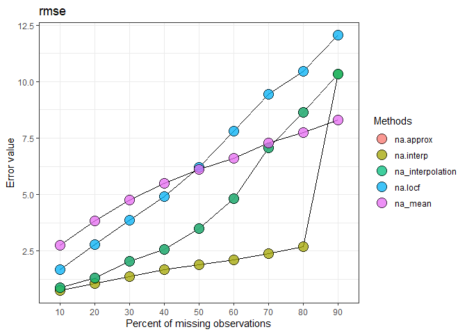

## imputeTestbench

#### *Neeraj Bokde, <neerajdhanraj@gmail.com>, Marcus W. Beck, <beck.marcus@epa.gov>*

[](https://travis-ci.org/fawda123/imputeTestbench)

[](https://ci.appveyor.com/project/fawda123/imputeTestbench)

[](https://CRAN.R-project.org/package=imputeTestbench)

This is the development repository for the imputeTestbench package. This
package provides a testbench for comparing imputation methods for
missing data in univariate time series.

The development version of this package can be installed from GitHub:

``` r
install.packages('devtools')
library(devtools)
install_github('neerajdhanraj/imputeTestbench', ref = 'development')
```

The current release can be installed from CRAN:

``` r
install.packages('imputeTestbench')
```

Load the package after installation:

``` r
library(imputeTestbench)
```

#### Basic use

The core function is `impute_errors()`. See the help documentation for
more details.

``` r
a <- impute_errors(data = nottem)
a
```

    ## $Parameter
    ## [1] "rmse"
    ## 
    ## $MissingPercent
    ## [1] 10 20 30 40 50 60 70 80 90
    ## 
    ## $na.approx
    ## [1]  0.8745735  1.3140905  2.0493222  2.5666394  3.4916234  4.8094359
    ## [7]  7.0808430  8.6298858 10.3312949
    ## 
    ## $na.interp
    ## [1]  0.7632089  1.0495005  1.3580821  1.6699538  1.9051306  2.1161712
    ## [7]  2.3753439  2.7078472 10.3312949
    ## 
    ## $na_interpolation
    ## [1]  0.8745735  1.3140905  2.0493222  2.5666394  3.4916234  4.8094359
    ## [7]  7.0808430  8.6298858 10.3312949
    ## 
    ## $na.locf
    ## [1]  1.679724  2.794649  3.861797  4.918532  6.209940  7.794973  9.441852
    ## [8] 10.466573 12.047612
    ## 
    ## $na_mean
    ## [1] 2.751165 3.822438 4.755763 5.485506 6.104211 6.620665 7.277600 7.737999
    ## [9] 8.305569

``` r
plot_errors(a, plotType = 'line')
```

<!-- -->

#### Citation

Beck MW, Bokde N, Ascencio-Cortes G, Kulat K (2018). “R package
imputeTestbench to Compare Imputation Methods for Univarite Time
Series.” *The R Journal*, *10*(1), 218-233. doi: 10.32614/RJ-2018-024
(URL: <http://doi.org/10.32614/RJ-2018-024>).

#### Bug reports

Please submit any bug reports (or suggestions) using the
[issues](https://github.com/neerajdhanraj/imputeTestbench/issues) tab of
the GitHub page.

#### License

This package is released in the public domain under the creative commons
license CC0.
