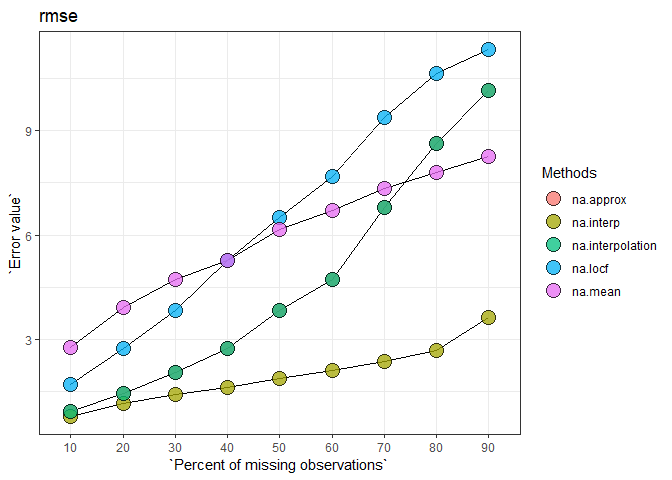

## imputeTestbench

#### *Neeraj Bokde, neerajdhanraj@gmail.com, Marcus W. Beck, beck.marcus@epa.gov*

[](https://travis-ci.org/fawda123/imputeTestbench)

[](https://ci.appveyor.com/project/fawda123/imputeTestbench)

[](https://CRAN.R-project.org/package=imputeTestbench)


This is the development repository for the imputeTestbench package.  This package provides a testbench for comparing imputation methods for missing data in univariate time series. 

The development version of this package can be installed from GitHub:


```r
install.packages('devtools')
library(devtools)
install_github('neerajdhanraj/imputeTestbench', ref = 'development')
```

The current release can be installed from CRAN:


```r
install.packages('imputeTestbench')
```

#### Basic use

The core function is `impute_errors()`.  See the help documentation for more details.


```r
library(imputeTestbench)
a <- impute_errors(data = nottem)
a
```

```
## $Parameter
## [1] "rmse"
## 
## $MissingPercent
## [1] 10 20 30 40 50 60 70 80 90
## 
## $na.approx
## [1]  0.9129603  1.4317351  2.0307697  2.7344815  3.8183655  4.7125571
## [7]  6.7814465  8.6227450 10.1656510
## 
## $na.interp
## [1] 0.7890747 1.1401742 1.4090457 1.6042341 1.8649604 2.1008303 2.3672584
## [8] 2.6875794 3.6260542
## 
## $na.interpolation
## [1]  0.9129603  1.4317351  2.0307697  2.7344815  3.8183655  4.7125571
## [7]  6.7814465  8.6227450 10.1656510
## 
## $na.locf
## [1]  1.705334  2.734398  3.837919  5.280977  6.495460  7.688837  9.391735
## [8] 10.638792 11.324989
## 
## $na.mean
## [1] 2.776585 3.927763 4.707457 5.262959 6.147728 6.711677 7.328183 7.806665
## [9] 8.254664
```

```r
plot_errors(a, plotType = 'line')
```

<!-- -->

#### Citation

Beck MW, Bokde N, Ascencio-Cortes G, Kulat K (2018). "R package imputeTestbench to Compare Imputation Methods for
Univarite Time Series." _The R Journal_, *10*(1), 218-233. doi: 10.32614/RJ-2018-024 (URL:
http://doi.org/10.32614/RJ-2018-024).

#### Bug reports 

Please submit any bug reports (or suggestions) using the [issues](https://github.com/neerajdhanraj/imputeTestbench/issues) tab of the GitHub page.

#### License

This package is released in the public domain under the creative commons license CC0.
